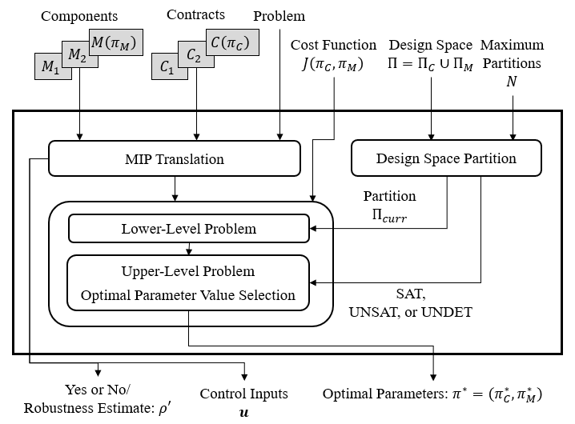

# PyCASSE

PyCASSE is a **Py**thon tool: **C**ontract-based **A**nalysis for **S**tochastic **S**ystems **E**xploration (PyCASSE). It enables automated reasoning with assume-guarantee (A/G) contracts expressed in Signal Temporal Logic (STL) and Stochastic Signal Temporal Logic (StSTL).

For details, please visit https://descyphy.github.io/pycasse.