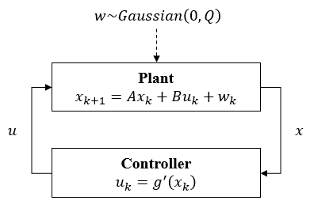

Control Synthesis with A/G Contract
===================================

PyCASSE enables reasoning about the behavior of a component :math:`M`, with given dynamics, using A/G contracts.

.. math::

   C_1 \wedge C_2 = & \; (V_1 \cup V_2, A_1 \cup A_2, G_1 \cap G_2) \\
   C_1 \otimes C_2 = & \; (V_1 \cup V_2, (A_1 \cap A_2) \cup \overline{(G_1 \cap G_2)}, G_1 \cap G_2) 

Control Synthesis with STL A/G Contract in PyCASSE
^^^^^^^^^^^^^^^^^^^^^^^^^^^^^^^^^^^^^^^^^^^^^^^^^^

.. code-block:: python

   from pycasse import *
   import time

   # Build a contract
   c = contract('c')                                               # Create a contract c
   c.add_deter_vars(['s', 'v', 'a'], 
      bounds = [[-100, 1000], [-5, 10], [-1, 1]])                  # Set deterministic variables
   c.set_assume('True')                                            # Set/define the assumptions
   c.set_guaran('G[0,10] ((F[0,5] (s => 3)) & (F[0,5] (s <= 0)))') # Set/define the guarantees
   c.checkSat()                                                    # Saturate c
   c.printInfo()                                                   # Print c

   # Build a linear system dynamics
   solver = MILPSolver()
   solver.add_contract(c)

   # Build a linear system dynamics
   solver.add_dynamics(x = ['s', 'v'], u = ['a'], A = [[1, 1], [0, 1]], B = [[0], [1]])

   # Add initial conditions
   solver.add_init_condition('s == 0')
   solver.add_init_condition('v == 0')

   # Add guarantee constraints
   solver.add_constraint(c.guarantee, name='b_g')

   # Solve the problem using MILP solver
   start = time.time()
   solved = solver.solve()
   end = time.time()
   print("Time elaspsed for MILP: {} [seconds].\n".format(end - start))
   if solved:
      solver.print_solution()

Control Synthesis with StSTL A/G Contract in PyCASSE
^^^^^^^^^^^^^^^^^^^^^^^^^^^^^^^^^^^^^^^^^^^^^^^^^^^^

.. code-block:: python

   from pycasse import *
   import time

   # Build a contract
   c = contract('c')                              # Create a contract c
   c.add_deter_vars(['s', 'v', 'a'], 
      bounds = [[-100, 2000], [-5, 10], [-1, 1]]) # Set deterministic variables
   c.set_assume('True')                           # Set/define the assumptions
   c.set_guaran('F[0,10] (P[0.9] (s => 34))')     # Set/define the guarantees
   c.checkSat()                                   # Saturate c
   c.printInfo()                                  # Print c

   # Build a linear system dynamics
   solver = MILPSolver()
   solver.add_contract(c)

   # Build a linear system dynamics
   solver.add_dynamics(x = ['s', 'v'], u = ['a'], A = [[1, 1], [0, 1]], B = [[0], [1]], Q = [[0, 0], [0, 0.5**2]])

   # Add initial conditions
   solver.add_init_condition('s == 0')
   solver.add_init_condition('v == 0')

   # Add guarantee constraints
   solver.add_constraint(c.guarantee, name='b_g')

   # Solve the problem using MILP solver
   start = time.time()
   solved = solver.solve()
   end = time.time()
   print("Time elaspsed for MILP: {} [seconds].\n".format(end - start))
   if solved:
      solver.print_solution()

asdf

.. figure:: figs/dyn_ststl_simu.png
   :width: 350
   :align: center

   :math:`10^5` simulation in MATLAB.

Simulations in MATLAB show that...