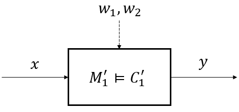

Examples
========

Multi-Agent Control Synthesis using Reward Contracts
----------------------------------------------------
An assume-guarantee (A/G) contract :math:`C` is a triple :math:`(V,A,G)` where :math:`V` is the set of variables, :math:`A` is the set of behaviors which a component (or system) expects from its environment, and :math:`G` is the set of behaviors that the component promises given that the environment provides behaviors within the assumption set. We say :math:`M` is an `implementation` of :math:`C` by writing :math:`M \models C`.

A contract is in `saturated` form if it satisfies :math:`\overline{A} \subseteq G` where :math:`\overline{A}` is the complement of :math:`A`. An unsaturated contract :math:`C'=(V,A,G)` can always be `saturated` to the equivalent contract :math:`C=(V,A,G')` where :math:`G'=G \cup \overline{A}`.

An A/G contract :math:`C = (V,A,G)` is `compatible` if there exists an environment behavior over the set of variables :math:`V`, i.e., :math:`A \neq \emptyset`, `consistent` if there exists a behavior satisfying the (saturated) guarantees, i.e., :math:`G \neq \emptyset`, and `feasible` if there exists a behavior that satisfies both the assumptions and the guarantees, i.e., :math:`A \cap G \neq \emptyset`.

Via `refinement`, we can reason about different abstraction layers in system design. A contract :math:`C_2 = (V,A_2,G_2)` refines :math:`C_1 = (V,A_1,G_1)` if and only if (1) :math:`A_1 \subseteq A_2` and (2) :math:`G_2 \subseteq G_1`. We denote this relationship as :math:`C_2 \preceq C_1`. Intuitively, if a contract :math:`C_2` refines another contract :math:`C_1`, then :math:`C_2` can replace :math:`C_1`. For further details we refer to the monograph [ContractMono]_.

Consider the component above. An STL contract :math:`C_1 = (V_1,A_1,G_1)` where :math:`V_1 := \{ x, y \}`, :math:`A_1 := \mathbf{G}_{[0,3]}(x \geq 5)`, and :math:`G_1 := \mathbf{G}_{[1,4]}(y \geq 2)` can be created as follows:

.. code-block:: python

   from pystl import *
   import numpy as np

   c1 = contract('c1')                   # Create a contract c1
   c1.set_deter_uncontrolled_vars(['x']) # Set a deterministic uncontrolled variable
   c1.set_controlled_vars(['y'])         # Set a controlled variable

   c1.set_assume('(G[0,3] (x => 5))')    # Set assumptions of c1
   c1.set_guaran('(G[1,3] (y => 2))')    # Set guarantees of c1
   c1.checkSat()                         # Saturate c1
   c1.printInfo()                        # Print information of c1

Using StSTL specifications, a contract :math:`C_1' = (V_1', A_1', G_1')` where :math:`V_1' = U' \cup X_1'`, :math:`U_1' := \{ w_1, w_2 \}`, :math:`X_1' := \{ x, y \}`, :math:`A_1' := \mathbf{G}_{[0,3]}(5 \leq x)`, :math:`G_1' := \mathbf{G}_{[1,3]}(P\{ y-2w_1+3w_2 \leq 8 \} \geq 0.95)`, and :math:`\mathbf{w} = [w_1, w_2]^T \sim N([0,2]^T, [[1,0],[0,1]])` can be created as follows:

.. code-block:: python

   c1_prime = contract('c1')                                      # Create a contract c1_prime
   c1_prime.set_deter_uncontrolled_vars(['x'])                    # Set a deterministic uncontrolled variable
   c1_prime.set_nondeter_uncontrolled_vars(['w1', 'w2'], \
         mean = np.array([0, 2]), cov = np.array([[1**2, 0], [0, 1**2]]))
                                                                  # Set nondeterministic uncontrolled variables
   c1_prime.set_controlled_vars(['y'])                            # Set a controlled variable
   c1_prime.set_assume('(G[0,3] (5 <= x))')                       # Set assumptions of c1_prime
   c1_prime.set_guaran('(G[1,3] (P[0.85] (y - 2w1 + 3w2 <= 8)))') # Set guarantees of c1_prime
   c1_prime.printInfo()                                           # Print c1_prime

Any contract in PyCASSE can be saturated and its information can be printed. For example, :math:`C_1` and :math:`C_1'` can be saturated and their information can be printed as follows:

.. code-block:: python

   c1.checkSat()                         # Saturate c1
   c1.printInfo()                        # Print c1

   c1_prime.checkSat()                   # Saturate c1_prime
   c1_prime.printInfo()                  # Print c1_prime

Please note that in PyCASSE, contracts are automatically saturated whenever necessary. 

ICCAD 2022 Case Studies
-----------------------

Using StSTL specifications, a contract :math:`C_1' = (V_1', A_1', G_1')` where :math:`V_1' = U' \cup X_1'`, :math:`U_1' := \{ w_1, w_2 \}`, :math:`X_1' := \{ x, y \}`, :math:`A_1' := \mathbf{G}_{[0,3]}(5 \leq x)`, :math:`G_1' := \mathbf{G}_{[1,3]}(P\{ y-2w_1+3w_2 \leq 8 \} \geq 0.95)`, and :math:`\mathbf{w} = [w_1, w_2]^T \sim N([0,2]^T, [[1,0],[0,1]])` can be created as follows:

.. code-block:: python

   c1_prime = contract('c1')                                      # Create a contract c1_prime
   c1_prime.set_deter_uncontrolled_vars(['x'])                    # Set a deterministic uncontrolled variable
   c1_prime.set_nondeter_uncontrolled_vars(['w1', 'w2'], \
         mean = np.array([0, 2]), cov = np.array([[1**2, 0], [0, 1**2]]))
                                                                  # Set nondeterministic uncontrolled variables
   c1_prime.set_controlled_vars(['y'])                            # Set a controlled variable
   c1_prime.set_assume('(G[0,3] (5 <= x))')                       # Set assumptions of c1_prime
   c1_prime.set_guaran('(G[1,3] (P[0.85] (y - 2w1 + 3w2 <= 8)))') # Set guarantees of c1_prime
   c1_prime.printInfo()                                           # Print c1_prime

Any contract in PyCASSE can be saturated and its information can be printed. For example, :math:`C_1` and :math:`C_1'` can be saturated and their information can be printed as follows:

.. code-block:: python

   c1.checkSat()                         # Saturate c1
   c1.printInfo()                        # Print c1

   c1_prime.checkSat()                   # Saturate c1_prime
   c1_prime.printInfo()                  # Print c1_prime

Please note that in PyCASSE, contracts are automatically saturated whenever necessary. 

PyCASSE Contract Class and Its Operations
^^^^^^^^^^^^^^^^^^^^^^^^^^^^^^^^^^^^^^^
.. automodule:: pystl.contracts
	:members:
	:exclude-members: set_params, merge_contract_variables, quotient, separation
